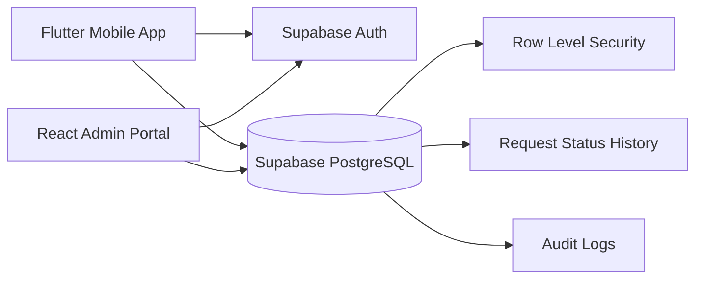

# QuickServe — SWASIQ Technology Internship Assignment

QuickServe is an end-to-end service request management system for **SWASIQ Health-tech, Nagpur**.

## Stack

- **Flutter** — customer/agent mobile app (Android/iOS)
- **React + Vite** — administrator web portal
- **Supabase** — PostgreSQL database, Auth, Row Level Security (RLS)
- **Git/GitHub** — source control

## Roles

- Customer: register/login, browse services, create requests, view/cancel own requests, profile/logout.
- Agent: login, view assigned requests, accept work, update status, add notes, view completed work.
- Admin: dashboard, customers, agents, all requests, assignment, status changes, audit activity.

## Request lifecycle

`CREATED → ASSIGNED → ACCEPTED → IN_PROGRESS → COMPLETED`

Eligible requests may be `CANCELLED`.

## Architecture



## Repository structure

```text
quickserve-swasiq/
├── mobile/                 # Flutter Android/iOS app
│   ├── lib/
│   │   ├── main.dart
│   │   ├── models/
│   │   ├── services/
│   │   ├── screens/
│   │   └── widgets/
│   └── test/
├── admin-web/              # React/Vite admin portal
│   ├── src/
│   └── .env.example
├── supabase/
│   └── schema.sql
├── docs/
│   ├── ARCHITECTURE.md
│   └── SECURITY.md
└── README.md
```

## Supabase setup

1. Create a project at Supabase.
2. Open **SQL Editor**.
3. Run `supabase/schema.sql`.
4. In Authentication > URL Configuration, configure the application URLs.
5. Copy the project URL and anon/publishable key into:
   - `mobile/lib/config.dart`
   - `admin-web/.env`
6. Enable email/password authentication.
7. Create the first admin account through Supabase Auth, then change its profile role to `admin` using the SQL editor or an approved admin bootstrap process.

> Never put the Supabase service-role key in Flutter, React, GitHub, or browser code.

## Flutter run

```bash
cd mobile
flutter pub get
flutter run
```

For Android APK:

```bash
flutter build apk --release
```

## Admin web run

```bash
cd admin-web
npm install
npm run dev
```

Production build:

```bash
npm run build
```

## Environment

Admin web `.env`:

```env
VITE_SUPABASE_URL=https://YOUR_PROJECT.supabase.co
VITE_SUPABASE_ANON_KEY=YOUR_ANON_KEY
```

Flutter configuration is intentionally kept in a small `config.dart` file for this internship submission. For a production app, inject build-time configuration using `--dart-define`.

## Test credentials

Create these accounts in Supabase Auth for demonstration:

```text
customer@quickserve.demo
agent@quickserve.demo
admin@quickserve.demo
```

Use strong temporary passwords and replace them before sharing the repository. The SQL schema contains the role model but does not store passwords.

## Security

RLS is enabled on all application tables.

- Customers can read/create/update only their own requests where permitted.
- Agents can read/update assigned requests.
- Admins can access operational data.
- Role checks happen inside PostgreSQL policies, not only in the UI.
- Audit events do not contain passwords, tokens, API keys, or secrets.

See `docs/SECURITY.md`.

## Logging

Meaningful events include:

- `LOGIN_SUCCESS`
- `LOGIN_FAILED`
- `REQUEST_CREATED`
- `REQUEST_ASSIGNED`
- `REQUEST_UPDATED`
- `AUTHORIZATION_FAILED`
- `DATABASE_ERROR`

## Important demo flow

1. Register/login as customer.
2. Browse services.
3. Create a request.
4. Login to admin portal.
5. Assign an agent.
6. Login as agent in Flutter.
7. Accept → In Progress → Completed.
8. Verify request history and audit log from admin.

## Git discipline

Recommended branches:

```text
main
develop
feature/flutter-mobile
feature/admin-portal
feature/supabase-security
```

Example meaningful commits:

```text
feat: add supabase authentication
feat: add customer request creation
feat: add agent request workflow
feat: add admin assignment dashboard
security: enforce request RLS policies
docs: add architecture and setup guide
test: add authorization coverage
```
