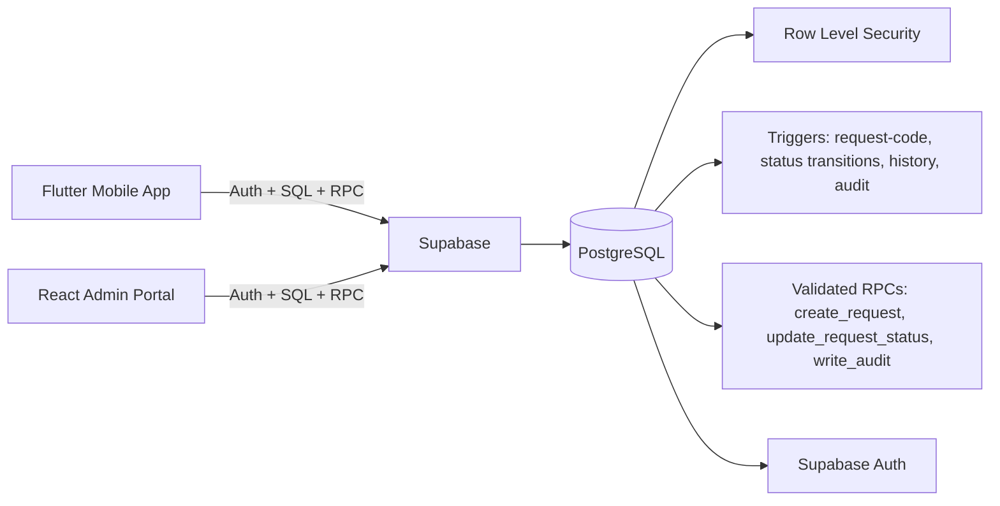
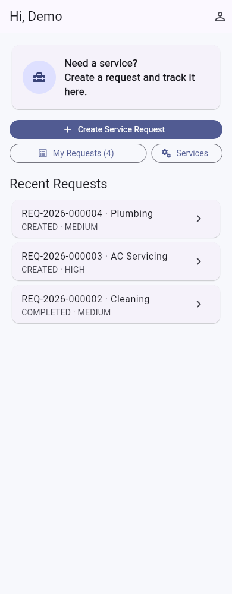
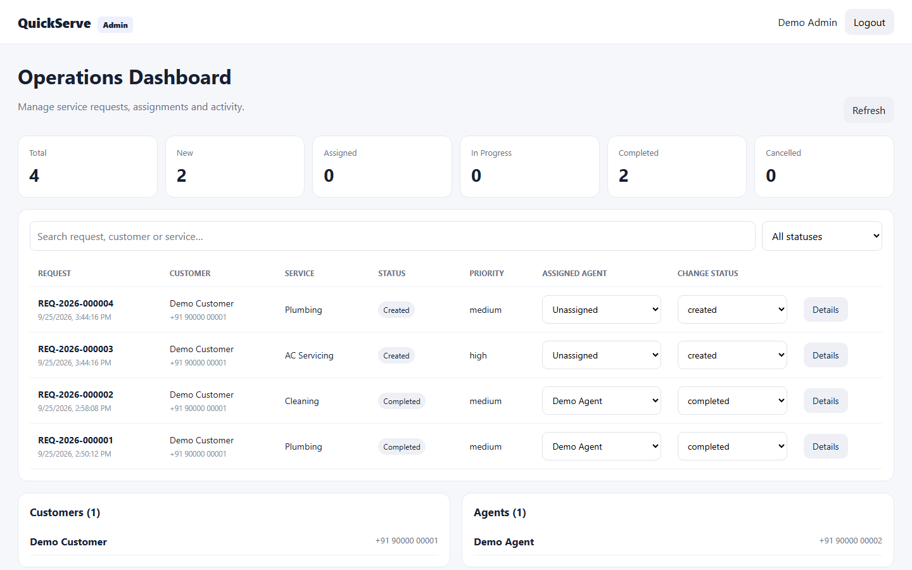

# QuickServe — SWASIQ Technology Internship Assignment

QuickServe is an end-to-end **Service Request Management** application built for the
SWASIQ (Health-tech, Nagpur) full-stack internship challenge.

- **Customers** browse services, create and track service requests from a **Flutter** mobile app.
- **Service agents** manage assigned work on the same mobile app.
- **Administrators** run operations from a **React web portal**.
- **Supabase** provides authentication, PostgreSQL, **Row Level Security**, status history and audit logging.

The authorization model is enforced **at the database layer** (RLS + validated RPCs), not merely by hiding UI buttons.

---

## Features

| Role | Capabilities |
| ---- | ------------ |
| **Customer** | Register / login / password reset · browse services · create requests (service, description, preferred date/time, address, priority) · view own requests · track status (with history timeline) · cancel eligible requests · profile / logout |
| **Agent** | Login · view assigned requests · accept → start work → mark completed · save work notes · view completed work |
| **Admin** | Web dashboard with totals (new/assigned/in-progress/completed/cancelled) · search & filter requests · assign agents · change status · customer & agent views · audit / activity log |

Request lifecycle, enforced by a database trigger:

```text
CREATED → ASSIGNED → ACCEPTED → IN_PROGRESS → COMPLETED
   └──────────────────┬─────────────────────┘
            (eligible) CANCELLED
```

Public request IDs are generated by the database: `REQ-2026-000123`.

---

## Tech stack

| Layer | Technology |
| ----- | ---------- |
| Mobile | Flutter 3.47 (Android / iOS) · `supabase_flutter` |
| Admin portal | React 19 · Vite · Tailwind-ready custom CSS (no heavy UI kit) |
| Backend | Supabase (PostgreSQL 15+, Auth, RLS, RPCs, triggers) |
| Tests | Flutter `flutter_test` · Vitest (admin) · Node RLS regression suite |
| CI | GitHub Actions (admin build / deploy-ready, Flutter analyze+test) |

---

## Repository structure

```text
quickserve/
├── mobile/                 # Flutter app (customer + agent)
│   ├── lib/
│   │   ├── main.dart       # app entry, splash routing
│   │   ├── config.dart     # Supabase URL/anon key (--dart-define injectable)
│   │   ├── models/         # data models + lifecycle rules
│   │   ├── services/       # Supabase client service layer
│   │   ├── screens/        # splash, auth, home, services, create request,
│   │   │                   #   my requests, request details, profile
│   │   └── widgets/        # status chip
│   └── test/               # widget + lifecycle unit tests
├── admin-web/              # React + Vite admin portal
│   ├── src/components/     # login, dashboard, requests, details modal, people, audit
│   └── src/utils.js        # search/filter logic (unit-tested)
├── supabase/
│   ├── 001_schema.sql      # tables, indexes, triggers, RPCs, RLS, seed services
│   ├── 002_seed.sql        # demo test accounts (idempotent)
│   └── README.md           # Supabase setup guide
├── tests/
│   ├── rls-authz.mjs       # RLS authorization regression tests (live project)
│   └── README.md
├── docs/
│   ├── ARCHITECTURE.md     # architecture + data model + Mermaid diagrams
│   ├── DATABASE.md         # tables, relationships, indexes, constraints
│   └── SECURITY.md         # RLS matrix, audit, secrets handling
├── .github/workflows/      # CI
└── README.md
```

---

## Architecture



See `docs/ARCHITECTURE.md` for the ER diagram and data flow.

---

## Screenshots (live project)

Captured against the **live Supabase project** (real data, not mocked). See
`docs/DEMO.md` for the full walkthrough.

**Mobile (Flutter)** — `docs/screenshots/mobile-01-login.png`,
`mobile-02-home.png`, `mobile-03-my-requests.png`,
`mobile-04-request-details.png`, `mobile-05-services.png`,
`mobile-07-agent-home.png`

**Admin portal (React)** — `docs/screenshots/admin-01-login.png`,
`admin-02-dashboard.png`, `admin-03-requests.png`, `admin-04-search.png`,
`admin-05-request-details.png`, `admin-06-people-audit.png`





---

## Getting started

### Prerequisites

- Flutter 3.x (`flutter doctor` clean) and an Android/iOS device or emulator
- Node.js 18+
- A free [Supabase](https://supabase.com) project

### 1. Provision the database

1. Create a Supabase project.
2. Open **SQL Editor → New query**.
3. Run `supabase/001_schema.sql` (tables, RLS, RPCs, triggers, service seed).
4. Run `supabase/002_seed.sql` (demo accounts).
5. In **Authentication → Providers** enable the **Email** provider.

Detailed notes: `supabase/README.md`.

### 2. Run the Flutter app

```bash
cd mobile
flutter pub get
flutter run
```

`lib/config.dart` already points at the bundled demo project (URL + **publishable** key),
so the app runs out of the box. To point it at your own project instead, override with
`--dart-define` (Project Settings → API → URL + anon/publishable key):

```bash
flutter run --dart-define=SUPABASE_URL=https://YOUR_PROJECT.supabase.co \
            --dart-define=SUPABASE_ANON_KEY=YOUR_ANON_KEY
```

No Android device/emulator? Web and desktop targets are included:
`flutter run -d chrome`, or serve the output of `flutter build web` (e.g. from
`mobile/build/web`) with any static file server.

Android release build:

```bash
cd mobile
flutter build apk --release
```

### 3. Run the admin portal

```bash
cd admin-web
npm install
cp .env.example .env   # then fill in your values
npm run dev
```

`.env`:

```env
VITE_SUPABASE_URL=https://YOUR_PROJECT.supabase.co
VITE_SUPABASE_ANON_KEY=YOUR_ANON_KEY
```

Only accounts with role `admin` may sign into the portal.

### 4. Run the tests

```bash
# Flutter (offline)
cd mobile && flutter test

# Admin portal
cd admin-web && npm test && npm run build

# RLS authorization proof (needs tests/.env with your project keys)
cd tests && npm install && cp .env.example .env && npm test
```

---

## Test credentials

Provided by `supabase/002_seed.sql` (change these before sharing the repository):

| Email                    | Role     | Password        |
| ------------------------ | -------- | --------------- |
| customer@quickserve.demo | customer | `QuickServe@123` |
| agent@quickserve.demo    | agent    | `QuickServe@123` |
| admin@quickserve.demo    | admin    | `QuickServe@123` |

---

## Security in one paragraph

Every application table has **Row Level Security** enabled. Roles come from the
`profiles` table through a `SECURITY DEFINER` helper (`current_user_role()`), so
clients cannot spoof a role. Customers can only read/create/update their own
requests; agents act only on assigned requests through a validated RPC
(`update_request_status`) that restricts columns and lifecycle transitions;
admins manage operational data and the audit log. A trigger closes role
self-promotion, another rejects illegal status transitions, and audit events
(`LOGIN_SUCCESS`, `LOGIN_FAILED`, `REQUEST_CREATED`, `REQUEST_ASSIGNED`,
`REQUEST_UPDATED`, `AUTHORIZATION_FAILED`, `DATABASE_ERROR`) are written only by
server-side functions — never with passwords, tokens or keys. Full details:
`docs/SECURITY.md`.

---

## Testing strategy

- **Flutter** — widget tests (splash/auth) + lifecycle transition unit tests.
- **Admin** — Vitest for search/filter logic and status vocabulary.
- **RLS regression (`tests/rls-authz.mjs`)** — signs in as real users against a
  live project and asserts the must-deny / must-allow matrix, including the
  assignment’s required test: *a customer attempting to access another
  customer's request is denied.*

## CI

GitHub Actions (`.github/workflows/`):

- `admin-build.yml` — installs and builds the admin portal on push/PR.
- `mobile-test.yml` — `flutter analyze` + `flutter test` on push/PR.

Secret-gated workflows (e.g. the RLS suite) can be enabled by adding repository
secrets for `SUPABASE_URL`, `SUPABASE_ANON_KEY` and `SUPABASE_SERVICE_ROLE_KEY`.

---

## SWASIQ submission checklist

| Deliverable | Status |
| ----------- | ------ |
| GitHub repository with clean structure | ✅ commit history + feature commits |
| Working Flutter app (customer + agent) | ✅ source + build steps |
| Working web admin portal | ✅ run/build steps |
| Supabase backend + database | ✅ `001_schema.sql` / `002_seed.sql` |
| Authentication + RBAC | ✅ email auth + roles + RLS + RPCs |
| Logging/audit trail + error handling | ✅ audit events + friendly errors |
| Architecture/database/security documentation | ✅ `docs/` |
| README + setup/test credentials | ✅ this file |
| Demo/walkthrough | ✅ `docs/DEMO.md` + `docs/screenshots/` (screenshots; video optional) |

## Demo flow (5 minutes)

1. Sign in as **customer** → browse services → create a request.
2. Sign in to the **admin portal** → assign an agent to the new request.
3. Sign in as **agent** → accept → start work → complete (add notes).
4. In the portal, open the request → scroll the **history** and the **audit log**.
5. Run `cd tests && npm test` and watch the RLS denials pass.

---

*Built for the SWASIQ Technology Internship Program. No secrets are stored in this repository.*