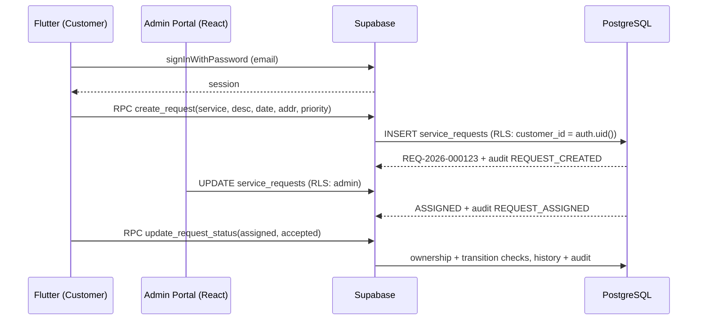
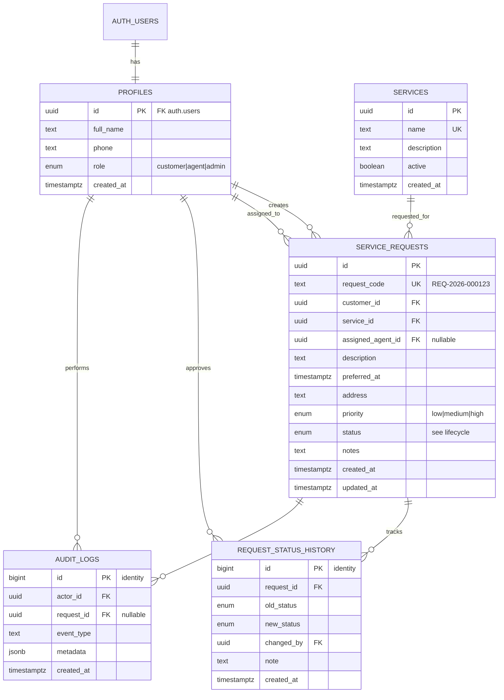

# QuickServe — Architecture & Database

## Components

### Flutter mobile app (`mobile/`)
Role-aware, but authorization is **never** decided by the UI alone. The app talks
to Supabase through a thin service layer (`lib/services/supabase_service.dart`)
that wraps RPCs and queries. Screens: Splash → Login/Register → Home →
Services / Create Request / My Requests / Request Details → Profile → Logout.

- **Secure status changes** go through the `update_request_status` RPC (the DB
  re-checks ownership, role and transition rules).
- **Auth events** (`LOGIN_SUCCESS`, `LOGIN_FAILED`) are written through the
  `write_audit` RPC after a real sign-in actually happens.
- Config is injectable via `--dart-define` with placeholder fallbacks.

### React admin portal (`admin-web/`)
Served by Vite. Components: `Login` (admin-only gate), `Dashboard` (stat cards),
`RequestsPanel` (search/filter/assign/status/details modal), `People`
(customers/agents), `AuditLog`. Data access is centralized in `src/api.js`;
search/filtering lives in unit-tested `src/utils.js`. A failed admin sign-in or a
non-admin sign-in attempt writes `AUTHORIZATION_FAILED` to the audit trail.

### Supabase backend (`supabase/`)
PostgreSQL + Auth + RLS + RPCs + triggers:

- `001_schema.sql` — schema, indexes, triggers, functions, RLS, service seed.
- `002_seed.sql` — demo accounts.

---

## System data flow

---

## Data model

## Important field rules

- `service_requests.request_code` — generated by a `BEFORE INSERT` trigger as
  `REQ-<year>-<6-digit sequence>`. Unique.
- `service_requests.status` — transitions enforced by trigger. No pass-through
  jumps, no changes to/from terminal states.
- `profiles.role` — immutable by the row owner; only an admin can change it
  (beware of the SQL trigger in addition to RLS).

See `docs/DATABASE.md` for full DDL-level detail and index rationale.