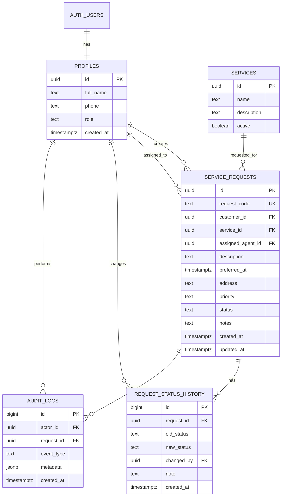

# Architecture and Database Documentation

## Components

### Flutter
The mobile application uses a small service/repository layer around Supabase. Screens are role-aware but backend authorization remains authoritative.

### React Admin
The admin portal uses Supabase Auth and direct database queries protected by RLS. It provides dashboard statistics, request assignment/status management, customer/agent views and audit information.

### Supabase
Supabase provides:
- PostgreSQL
- Auth
- RLS
- SQL functions/triggers
- Realtime-ready infrastructure

## Data model

## Indexes

Indexes are provided for:
- request code
- customer ID
- assigned agent ID
- request status
- created date
- audit actor/date

These support common dashboard and role-specific queries.
